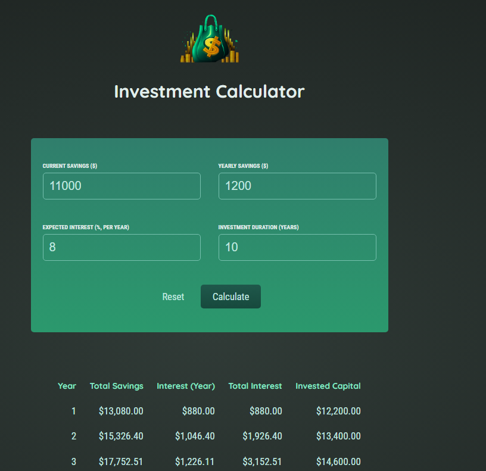

# investment-calculator


A simple investment calculator using React.


## Getting started
Clone the repository and install some dependencies
```
git clone https://github.com/fermat01/investment-calculator.git
cd reactjs-project
npm install
npm start
```

Go to url 
```
http://localhost:3000

```

 The application can be found [here](https://fermat01.github.io/investment-calculator/).



